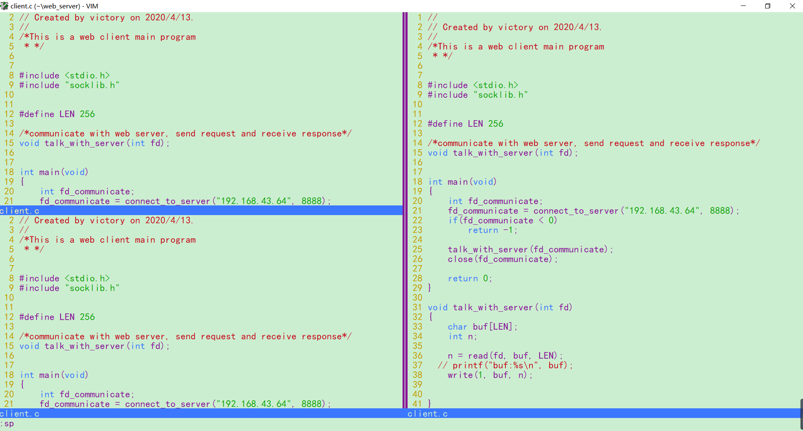

## table and window and buffer, vim working area

### buffer 

#### what is buffer
buffer is an internal representation of file. every file opened has it's own buffer.For example, you can type `vim animal.py` to open a file, then you can type `:ls` see all buffers list.

#### buffer common operation 

| key           | behavior     
| ------------- |:---------------------------------------------------------:|
| `:b 1`        | open the buffer that id is 1                              |
| `:b cat`      | open the buffer which filename has "cat" string (only 1)  |
| `:bn`         | open the next buffer                                      |  
| `:bp`         | open the previous buffer                                  |
| `:bd`         | delete the buffer(relase the memory                       |

### window 

vim support multiple windows on one screen 

#### create, delete, jump window 

| key               | behavior     
| ----------------- |:--------------------------------------------------:|
| `:sp cat.py`      | spilt vertically into 2 windows                    |
| `:vsp cat.py`     | spilt horizontally into 2 windows                  |  
| `<c-w> + h/j/k/l `| move the cursor to left/down/up/right window       |  
| `<c-w> + q`       | close the current window                           |
| `<c-w> + o`       | close the other windows                            |

#### change the size of window 

| key               | behavior     
| -----------------------|:--------------------------------------------------:|
| `<c-w> + =`            | adjustment all windows (height width same)         |
| `resize  +N`           | height add N lines                                 |
| `resize  -N`           | height less N lines                                |
| `vertical resize  +/-N`| width add/less N lines                             |
| `resize N`             | set the hight to N lines                           |
| `vertical resize N`    | set the width to N lines                           |

### tabs 

#### what is tabs 

vim uses tabs to organize the colletion of the windows 

#### common operation 

| key           | behavior     
| ------------- |:---------------------------------------------------------:|
| `:tabnew`     | open a new tab                                            |
| `:tabnext`    | jump to a next tab                                        |
| `:tabprevious`| jump to a previous tab                                    |
